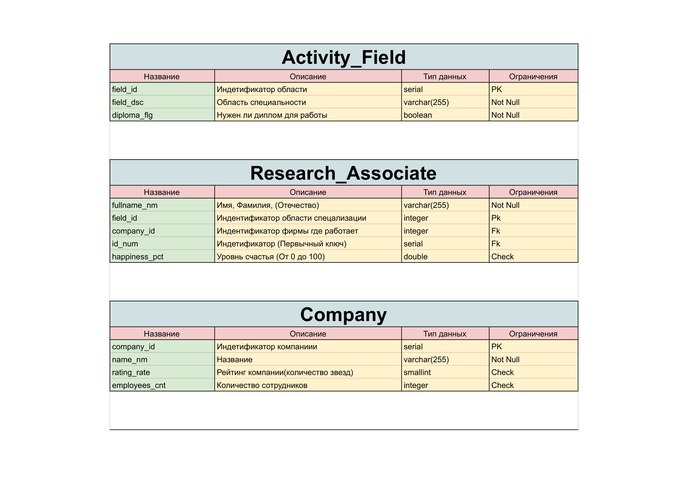
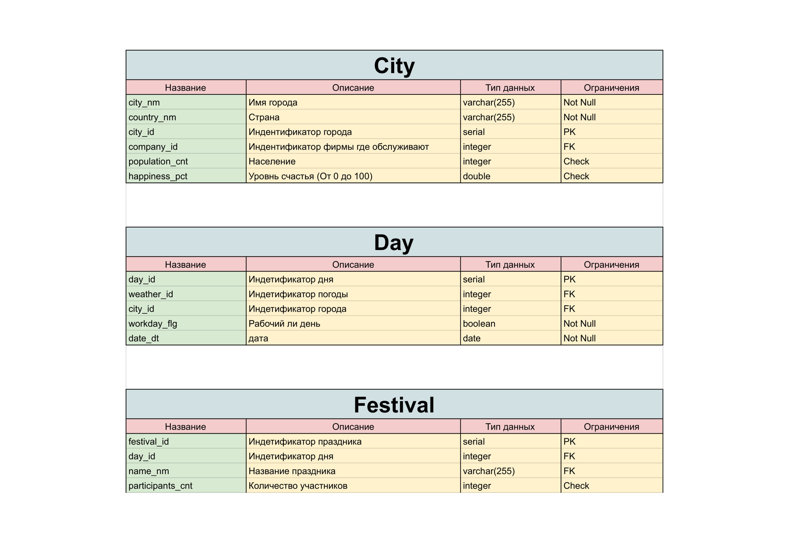
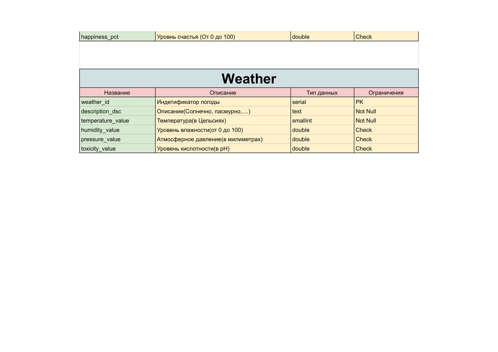

**Проект по Базам Данных**
==================================================================================

Добро пожаловать на базу данных Странные погодные компании, Города и праздники.Есть компании, они умеют менять погоду. Города они хотят хорошую погоду на праздники. Есть данные про проведенные праздники по погоде и уровню счастья. Есть таблица сотрудников, некоторые специализации требуют диплом а некоторые нет. У нас довольно интересно и запутанно :)

Ниже можно ознакомиться с концептуальной, логической и физической моделью.

Смыслы запросов оставлял в виде комментариев к запросам.

***

**Модели**
-----------------------------

# Концепруальная

## Логическая

### Физическая

***
